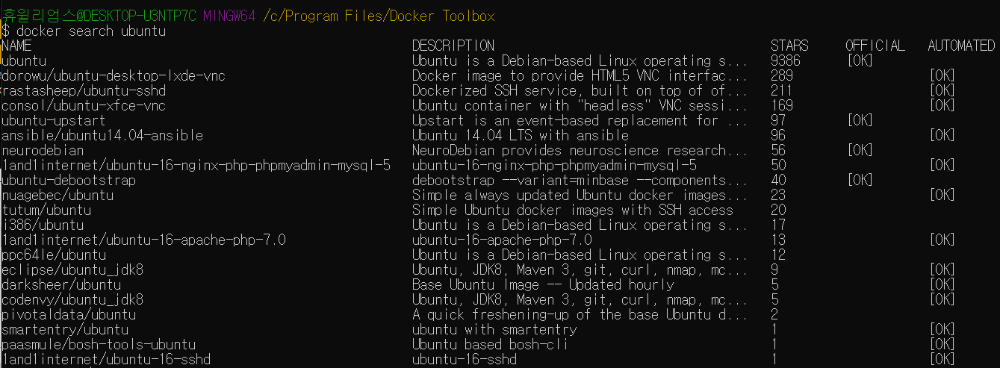
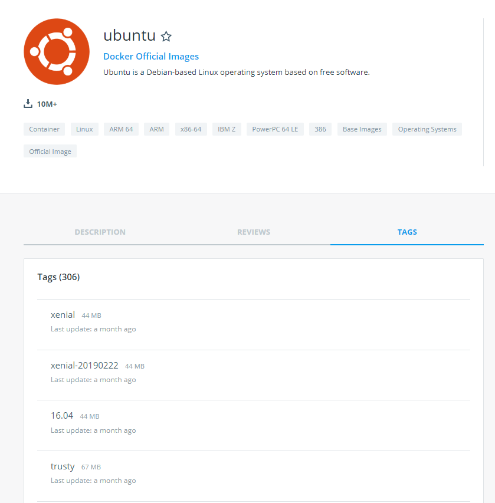
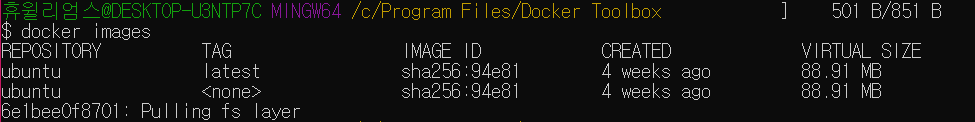
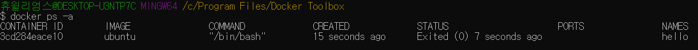

Docker 사용해보기
==========
Docker 명령은 docker <명령> 형식이며, root 권한으로 실행해야 한다.  
명령 실습은 Docker Quickstart Terminal 에서 실행했다.  

## search : 이미지 검색
Docker 는 Docker Hub(https://registry.hub.docker.com)에 이미지를 공유하는 생태계가 구축되어 있다.  
유명 리눅스 배포판과 오픈 소스 프로젝트의 이미지를 DockerHub 에서 구할 수 있다.
<pre>
docker search</pre>
명령으로 DockerHub에서 이미지를 검색할 수 있다.  

DockerHub 에서 이미지를 검색한 뒤 해당 이미지의 Tags 탭을 보면 현재 사용할 수 있는 이미지의 버전을 볼 수 있다.  

##pull : 이미지 받기  
Docker Hub 에서 우분투 리눅스 이미지를 받는다.  
<pre>
sudo docker pull ubuntu:latest
</pre>
docker pull <이미지이름>:<태그> 형식이다.  
latest를 설정하면 최신 버전을 받는다.  
이미지 이름에서 huewilliams/ubuntu 처럼 / 앞에 사용자명을 지정하면 DockerHub에서 해당 사용자가 올린 이미지를 받는다.  

##images : 이미지 목록
이미지의 목록을 출력한다. 
<pre>
docker images
</pre>
docker images 는 모든 이미지 목록을 출력한다.  

##run : 컨테이너 생성
이미지를 컨테이너로 생성한 뒤 Bash 셸을 실행
<pre>
docker run -i -t --name hello ubuntu /bin/bash
</pre>
docker run <옵션> <이미지 이름> <실행할 파일> 형식이다.  
여기서는 ubuntu 이미지를 컨테이너로 생성한 뒤 ubuntu 이미지 안의 /bin/bash 를 실행한다.  
> -i -t 옵션으로 Bash 셸 입출력 가능
> --name 옵션으로 컨테이너 이름 지정

이것으로 호스트 OS와 완전히 격리된 공간이 생성된다.  
exit 를 입력하여 Bash 셸을 빠져나오면 컨테이너가 정지된다.  

## ps : 컨테이너 목록 확인
<pre>
docker ps
</pre>
-a 옵션을 사용하면 정지된 컨테이너까지 모두 출력하고, 옵션을 사용하지 않으면 실행되고 있는 컨테이너만 출력한다.  

## start : 컨테이너 시작
<pre>
docker start hello
</pre>
docker start <컨테이너 이름> 형식이다.  

## restart : 컨테이너 재시작
<pre>
docker restart hello
</pre>
docker restart <컨테이너 이름> 형식이다.  

## attach : 컨테이너 접속
<pre>
docker attach hello
</pre>
docker attach <컨테이너 이름> 형식이다.  
Bash 셸에서 exit 또는 <code>Ctrl+D</code>를 입력하면 컨테이너가 정지된다.  
<code>Ctrl P , Ctrl Q</code>를 차례대로 입력하여 컨테이너를 정지하지 않고 빠져나온다.  
## exec : 컨테이너 안의 명령 실행
<pre>
docker exec hello echo "Hello World"
</pre>
docker exec <컨테이너 이름> <명령> <매개 변수> 형식이다.  
컨테이너가 실행 중인 상태에서만 가능하다.  
docker exec 명령은 이미 실행된 컨테이너에 apt-get, yum 등으로 패키지를 설치하거나, 각종 데몬 실행에 활용된다.  

##stop : 컨테이너 정지
<pre>
docker stop hello
</pre>
docker stop <컨테이너 이름> 형식이다.  

##rm : 컨테이너 삭제  
<pre>
docker rm hello
</pre>
docker rm <컨테이너 이름> 형식이다.  

##rmi : 이미지 삭제
<pre>
docker rmi ubuntu:latest
</pre>
docker rmi <이미지 이름>:<태그> 형식이다.  
docker rmi ubuntu 처럼 이름만 지정하면 ubuntu 이름을 가진 모든 이미지가 삭제된다.